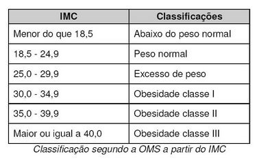

# Exercícios - Aula 06

#### Exercício 1

Crie um programa em Javascript que calcule a **média USJT** de um aluno.

O programa deve:

1. Solicitar ao usuário três notas (0 a 100%).  
2. Calcular a média ponderada utilizando a fórmula:

~~~java
media = (nota1 * 30 + nota2 * 30 + nota3 * 40) / 100;
~~~

3. Exibir o valor da média na tela.

#### Exercício 2

Crie um programa em Javascript que calcule o **IMC (Índice de Massa Corporal)** de uma pessoa.

O programa deve:

1. Solicitar ao usuário o **peso** (em quilogramas).  
2. Solicitar ao usuário a **altura** (em metros).  
3. Calcular o IMC utilizando a fórmula:

~~~java
IMC = peso / (altura * altura);
~~~

Bonus fazer com desvios condicionais imprimindo a classificação

4. Exibir o valor do IMC na tela.

#### Exercício 3
Ler um número inteiro de 3 dígitos e apresentar a unidade, dezena e centena deste número. 
> Exemplo para a leitura do inteiro 742

~~~java
CENTENA: 7
DEZENA: 4
UNIDADE: 2
~~~

#### Exercício 4
Ler o horário de início e término de uma reunião e apresentar o tempo de duração da reunião.